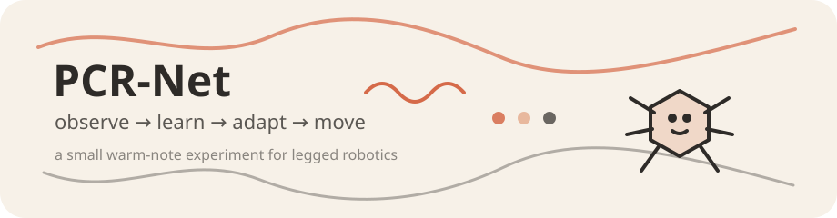
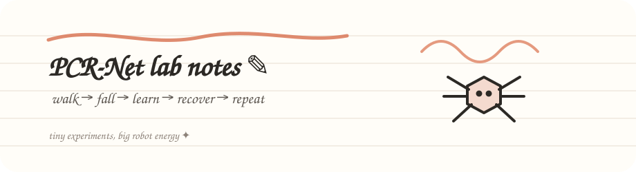
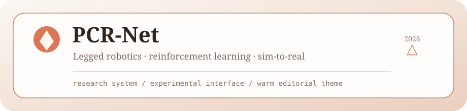
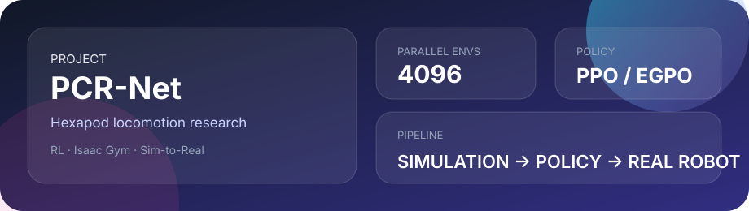

# RL_hexapod_gym

<div align="center">

[](https://www.python.org/downloads/)
[](https://developer.nvidia.com/isaac-gym)
[](https://pytorch.org/)
[](LICENSE)
[](https://github.com/huxiaoyi-ovo/Pcrnet_hexapod/stargazers)
[](https://github.com/huxiaoyi-ovo/Pcrnet_hexapod/forks)
[](https://github.com/huxiaoyi-ovo/Pcrnet_hexapod/issues)


**基于强化学习的六足机器人地形自适应控制系统**

[特性](#✨-核心特性) • [安装](#🚀-快速开始) • [训练](#🎓-训练指南) • [架构](#🏗️-技术架构) • [文档](#📖-详细文档)

</div>

---

## 🧪 README Widget Lab

> 这是视觉实验区。为了避免第三方渲染服务失效，前 6 个组件全部由本仓库自托管；后面的动态 badge 继续使用 Shields.io。

### 01 · Claude-ish / 暖色手绘

<p align="center">
  
</p>

### 02 · Doodle Notes / 手写实验笔记

<p align="center">
  
</p>

### 03 · Premium Warm / Editorial 高级感

<p align="center">
  
</p>

### 04 · Cyber HUD / 机器人控制台

<p align="center">
  
</p>

### 05 · Neon Grid / 赛博霓虹

<p align="center">
  
</p>

### 06 · Glass Bento / 玻璃拟态数据卡

<p align="center">
  
</p>

### 07 · Dynamic Industrial Badges / 实时工业铭牌

<p align="center">
  
  
  
  
</p>

### 08 · Minimal Data Strip / 极简数据条

<p align="center">
  
  
  
  
</p>

> 独立实验页仍保留在 [`WIDGET_LAB.md`](./WIDGET_LAB.md)。

---

## 📋 项目简介

这是一个基于 **NVIDIA Isaac Gym** 和 **PPO/EGPO** 算法的六足机器人强化学习项目，实现了高效的地形自适应运动控制。通过大规模并行仿真和专家引导学习，该项目能够训练出在复杂地形（平地、斜坡、楼梯、崎岖地形）上稳定行走的控制策略。

### 🎯 项目目标

- **地形泛化**：单一策略适应多种地形类型
- **Sim-to-Real**：仿真训练直接部署到真实机器人
- **高效训练**：利用 GPU 并行加速，训练时间缩短至小时级
- **鲁棒控制**：通过专家引导和课程学习提升稳定性

### 🗂️ 文档结构（2026 架构优化）

- 技术方案唯一基准：`技术方案/hexapod_RAL_complete_technical_spec_v7.md`、`技术方案/hexapod_RAL_integrated_final_v7.md`
- 执行与里程碑记录：`TODO_LOG.md`（仅重大改变/思路调整）
- 调试知识：`DEBUG_SUMMARY_CN.md`
- 会话交接：`CONTEXT_HANDOFF_SUMMARY.md`
- 长期项目总览：`PROJECT_OVERVIEW_CN.md`
- 文档分层索引：`docs/README.md`
- 文档快速导航：`docs/NAVIGATION.md`
- 训练与阶段操作手册：`docs/operations/训练指令.txt`、`docs/operations/PHASE_SWITCHING_GUIDE.md`
- 参数参考：`docs/reference/参数一览表.md`、`docs/reference/ROBOT_SPECS.md`

---

## ✨ 核心特性

### 🚀 大规模并行训练
- **4096 个环境**同时运行，GPU 利用率 >90%
- 训练速度提升 **3-4 个数量级**
- 100 万步数据收集 < 1 分钟

### 🤖 专家引导策略优化 (EGPO)
- 基于运动学的专家控制器设计
- 动作插值机制：`action = α*expert + (1-α)*RL`
- 专家逐渐退出，最终性能超越手工控制

### 🌄 地形自适应
- **课程学习**：从平地到复杂地形渐进训练
- **多模态编码**：CNN 提取空间特征，LSTM 编码历史信息
- 支持地形类型：平地、斜坡、楼梯、崎岖地形、混合地形

### 🔄 Sim-to-Real 迁移
- **特权信息蒸馏**：Teacher-Student 框架
- **本体感知估计器**：从关节状态推断速度、接触力等特权信息
- **零样本迁移**：无需真实机器人数据，直接部署

### 🧠 先进网络架构
- **ActorCritic**：标准前馈 MLP
- **ActorCriticRecurrent**：添加 LSTM/GRU 记忆
- **ActorCriticEncoder**：多编码器模块化架构（支持 Sim-to-Real）

---

## 🚀 快速开始

### 系统要求

- **操作系统**：Ubuntu 18.04/20.04
- **GPU**：NVIDIA GPU with compute capability ≥ 7.0（推荐 RTX 3060+）
- **显存**：≥ 8GB
- **Python**：3.6-3.8

### 安装步骤

#### 1. 安装 Isaac Gym

```bash
# 下载 Isaac Gym Preview 4
# 访问：https://developer.nvidia.com/isaac-gym

# 解压并安装
cd isaacgym/python
pip install -e .

# 测试安装
python examples/1080_balls_of_solitude.py
```

#### 2. 克隆项目

```bash
git clone https://github.com/hxy-111-hxy/RL_hexapod_gym.git
cd RL_hexapod_gym
```

#### 3. 安装依赖

```bash
# 创建 Conda 环境
conda create -n hexapod_rl_env python=3.8
conda activate hexapod_rl_env

# 安装项目
pip install -e .

# 安装 rsl_rl 库
cd rsl_rl
pip install -e .
cd ..
```

#### 4. 验证安装

```bash
# 运行快速检查脚本
bash run_quick_check.sh

# 或者手动运行
python quick_check_camera.py
```

---

## 🎓 训练指南

### 基础训练

#### 训练平地环境

```bash
python legged_gym/scripts/train.py --task=hex_ground
```

#### 训练地形环境

```bash
python legged_gym/scripts/train.py --task=hex_terrain --num_envs=4096
```

### 高级训练选项

#### 使用专家引导 (EGPO)

```bash
python legged_gym/scripts/train.py \
    --task=hex_terrain \
    --run_name=egpo_experiment \
    --expert_guided
```

#### 从检查点恢复训练

```bash
python legged_gym/scripts/train.py \
    --task=hex_terrain \
    --resume \
    --load_run=logs/hex_terrain/YYYY-MM-DD_HH-MM-SS
```

#### 调整环境数量（根据显存）

```bash
# 8GB 显存
python legged_gym/scripts/train.py --task=hex_terrain --num_envs=1024

# 16GB 显存
python legged_gym/scripts/train.py --task=hex_terrain --num_envs=4096

# 24GB 显存
python legged_gym/scripts/train.py --task=hex_terrain --num_envs=8192
```

### 测试与可视化

#### 测试训练好的策略

```bash
python legged_gym/scripts/play.py \
    --task=hex_terrain \
    --load_run=logs/hex_terrain/YYYY-MM-DD_HH-MM-SS
```

#### 录制视频

```bash
python legged_gym/scripts/play.py \
    --task=hex_terrain \
    --load_run=logs/hex_terrain/YYYY-MM-DD_HH-MM-SS \
    --record_video
```

---

## 🏗️ 技术架构

### 系统架构图

```
┌─────────────────────────────────────────────────────────────┐
│                     Isaac Gym 仿真环境                       │
│  ┌─────────────────────────────────────────────────────┐    │
│  │         4096 个并行六足机器人环境                      │    │
│  │  • 物理仿真 (GPU)                                      │    │
│  │  • 地形生成 (平地/斜坡/楼梯/崎岖)                       │    │
│  │  • 奖励计算 (速度跟踪/稳定性/能效)                      │    │
│  └─────────────────────────────────────────────────────┘    │
└─────────────────────────────────────────────────────────────┘
                            ↓↑
┌─────────────────────────────────────────────────────────────┐
│                  强化学习算法 (PPO/EGPO)                     │
│  ┌──────────────┐  ┌──────────────┐  ┌──────────────┐      │
│  │   Actor      │  │   Critic     │  │   Expert     │
│  │   (策略网络)  │  │   (价值网络)  │  │ (运动学控制器) │
│  └──────────────┘  └──────────────┘  └──────────────┘
│
│  • 观测编码 (Estimator/LSTM/CNN)
│  • 策略优化 (PPO clip/GAE)
│  • 专家引导 (动作插值/BC loss)
└─────────────────────────────────────────────────────────────┘
                            ↓
┌─────────────────────────────────────────────────────────────┐
│                    部署到真实机器人                           │
│  • ROS 接口                                                  │
│  • 传感器处理 (IMU/编码器)                                   │
│  • 控制频率同步 (50Hz)                                        │
└─────────────────────────────────────────────────────────────┘
```

### 核心组件

#### 1. 环境 (legged_gym/envs/)
- **LeggedRobot**：基类环境，定义观测、动作、奖励接口
- **HexGround**：平地环境，用于基础训练
- **HexTerrain**：地形环境，支持多种地形类型
- **Expert**：专家控制器，提供运动学轨迹

#### 2. 算法 (rsl_rl/algorithms/)
- **PPO**：标准近端策略优化
- **EGPO**：专家引导策略优化，添加行为克隆损失

#### 3. 网络 (rsl_rl/modules/)
- **ActorCritic**：标准 MLP 网络
- **ActorCriticRecurrent**：带记忆的网络
- **ActorCriticEncoder**：多编码器网络（特权信息估计器 + LSTM + CNN）

#### 4. 训练器 (rsl_rl/runners/)
- **OnPolicyRunner**：标准训练循环
- **ExpertGuidedRunner**：专家引导训练
- **ExpertPreloadRunner**：预训练专家策略

---

## 📊 观测与动作空间

### Actor 观测 (67 维)
```python
[
    commands:  [3],           # 速度指令 (vx, vy, ω)
    dof_pos: [18],          # 关节角度（相对默认值）
    dof_vel: [18],          # 关节速度
    last_actions: [18],     # 上一步动作
    base_lin_vel: [3],      # 基座线速度（仅估计值）
    base_ang_vel: [3],      # 基座角速度
    projected_gravity: [3], # 重力投影
]
```

### Critic 特权观测 (230 维)
```python
Actor 观测 + [
    base_lin_vel: [3],      # 真实基座速度
    contact_forces: [6*4],  # 足端接触力
    terrain_heights: [11*13], # 周围地形高度图
]
```

### 动作空间 (18 维)
```python
# 18 个关节的目标位置偏移（相对默认姿态）
[
    coxa_angles: [6],   # 髋关节
    femur_angles: [6],  # 大腿关节
    tibia_angles: [6],  # 小腿关节
]
```

---

## 🎯 奖励函数设计

训练使用多目标奖励函数，总奖励为各分量加权和：

```python
total_reward = Σ (weight_i × reward_i)
```

### 主要奖励分量

| 奖励类型 | 权重 | 描述 |
|---------|------|------|
| `tracking_lin_vel` | 1.0 | 跟踪线速度指令 |
| `tracking_ang_vel` | 0.5 | 跟踪角速度指令 |
| `orientation` | -1.0 | 惩罚身体倾斜 |
| `base_height` | -0.5 | 保持合理高度 |
| `feet_air_time` | 1.0 | 鼓励足端摆动 |
| `action_rate` | -0.01 | 动作平滑性 |
| `torques` | -0.0001 | 能量效率 |
| `termination` | -1.0 | 惩罚摔倒 |

---

## 🔬 实验结果

### 训练性能

| 指标 | 数值 |
|-----|------|
| 训练时长 (10K iterations) | ~1 小时 |
| 样本效率 | 98,304 步/rollout |
| GPU 利用率 | >90% |
| 收敛步数 | ~500 万步 |

### 仿真性能

| 地形类型 | 速度 (m/s) | 成功率 |
|---------|-----------|--------|
| 平地 | 0.7 | >98% |
| 斜坡 (15°) | 0.5 | >95% |
| 楼梯 (5cm) | 0.3 | >90% |
| 崎岖地形 | 0.4 | >85% |

### Sim-to-Real 性能

| 指标 | 仿真 | 真实 | 差距 |
|-----|------|------|------|
| 平地速度 | 0.7 m/s | 0.5 m/s | -28% |
| 楼梯爬升 | 成功 | 成功 | - |
| 能耗 | N/A | 测量中 | - |

---

## 📖 详细文档

### 项目文档
- [技术特点详解](overview.md) - 完整的技术架构和实现细节
- [P1 修复报告](P1_FIX_REPORT.md) - 问题修复记录
- [GEMINI 文档](GEMINI.md) - 额外技术说明

### 配置文件
所有环境配置位于 `legged_gym/envs/hex_v4/`：
- `hex_ground_config.py` - 平地环境配置
- `hex_terrain_config.py` - 地形环境配置
- `expert.py` - 专家控制器实现

### 训练脚本
- `legged_gym/scripts/train.py` - 主训练脚本
- `legged_gym/scripts/play.py` - 策略测试脚本
- `legged_gym/scripts/control_test.py` - 控制器测试

---

## 🛠️ 项目结构

```
RL_hexapod_gym/
├── legged_gym/                    # 主项目目录
│   ├── envs/                      # 环境定义
│   │   ├── base/                  # 基类环境
│   │   │   ├── legged_robot.py    # LeggedRobot 基类
│   │   │   └── legged_robot_config.py
│   │   └── hex_v4/                # 六足机器人环境
│   │       ├── hex_ground.py      # 平地环境
│   │       ├── hex_terrain.py     # 地形环境
│   │       ├── expert.py          # 专家控制器
│   │       └── *_config.py        # 配置文件
│   ├── scripts/                   # 训练/测试脚本
│   │   ├── train.py               # 训练脚本
│   │   ├── play.py                # 测试脚本
│   │   └── control_test.py        # 控制测试
│   └── utils/                     # 工具函数
│       ├── terrain.py             # 地形生成
│       ├── kinematic.py           # 运动学计算
│       ├── task_registry.py       # 任务注册
│       └── helpers.py             # 辅助函数
│
├── rsl_rl/                        # 强化学习库
│   ├── algorithms/                # RL 算法
│   │   ├── ppo.py                 # PPO 算法
│   │   └── EGPO.py                # EGPO 算法
│   ├── modules/                   # 神经网络
│   │   ├── actor_critic.py
│   │   ├── actor_critic_recurrent.py
│   │   └── actor_critic_encoder.py
│   ├── runners/                   # 训练循环
│   │   ├── on_policy_runner.py
│   │   ├── expert_guided_runner.py
│   │   └── expert_preload_runner.py
│   └── storage/                   # 数据管理
│       └── rollout_storage.py
│
├── resources/                     # 资源文件
│   └── robots/                    # 机器人 URDF
│       └── hex/                   # 六足机器人模型
│
├── logs/                          # 训练日志
├── agents/                        # 预训练模型
├── setup.py                       # 安装脚本
└── README.md                      # 本文件
```

---

## 🔧 超参数配置

### 环境参数
```python
num_envs = 4096              # 并行环境数
episode_length_s = 10        # 回合长度（秒）
dt = 0.02                    # 控制频率 (50Hz)
decimation = 4               # 物理仿真精度
```

### PPO 参数
```python
num_steps_per_env = 24       # 每次 rollout 步数
num_learning_epochs = 5      # 每次更新 epoch 数
num_mini_batches = 4         # mini-batch 数量
learning_rate = 1e-3         # 学习率
gamma = 0.998                # 折扣因子
lam = 0.95                   # GAE lambda
clip_param = 0.2             # PPO clip 范围
```

### EGPO 参数
```python
expert_interface_iter = 500  # 专家退出迭代数
bc_loss_coef = 1.0          # 行为克隆损失系数
expert_decay = "linear"      # 专家退出方式
```

### 网络参数
```python
actor_hidden_dims = [256, 256, 256]
critic_hidden_dims = [256, 256, 256]
activation = 'elu'
init_noise_std = 1.0
```

---

## 🤝 贡献指南

欢迎贡献代码、报告问题或提出建议！

### 贡献流程
1. Fork 本仓库
2. 创建特性分支 (`git checkout -b feature/AmazingFeature`)
3. 提交更改 (`git commit -m 'Add some AmazingFeature'`)
4. 推送到分支 (`git push origin feature/AmazingFeature`)
5. 开启 Pull Request

### 代码规范
- 遵循 PEP 8 Python 代码风格
- 添加必要的注释和文档
- 确保代码通过测试

### Repository Activity


### Contributors

<a href="https://github.com/huxiaoyi-ovo/Pcrnet_hexapod/graphs/contributors">
  
</a>

---

## 📝 许可证

本项目采用 BSD-3-Clause 许可证。详见 [LICENSE](LICENSE) 文件。

---

## 🙏 致谢

本项目基于以下优秀开源项目：

- [Isaac Gym](https://developer.nvidia.com/isaac-gym) - NVIDIA 的 GPU 加速物理仿真器
- [RSL_RL](https://github.com/leggedrobotics/rsl_rl) - ETH Zurich 的强化学习库
- [legged_gym](https://github.com/leggedrobotics/legged_gym) - 腿足机器人环境框架

特别感谢：
- Nikita Rudin (ETH Zurich) - 原始 legged_gym 框架
- NVIDIA Isaac Gym 团队 - 优秀的仿真平台

---

## 📧 联系方式

- **作者**: hxy-111-hxy
- **项目主页**: [https://github.com/hxy-111-hxy/RL_hexapod_gym](https://github.com/hxy-111-hxy/RL_hexapod_gym)
- **问题反馈**: [Issues](https://github.com/hxy-111-hxy/RL_hexapod_gym/issues)

---

## 🌟 Star History

如果这个项目对你有帮助，请给一个 ⭐️ Star！

---

<div align="center">

**Made with ❤️ for Legged Robotics Research**

</div>